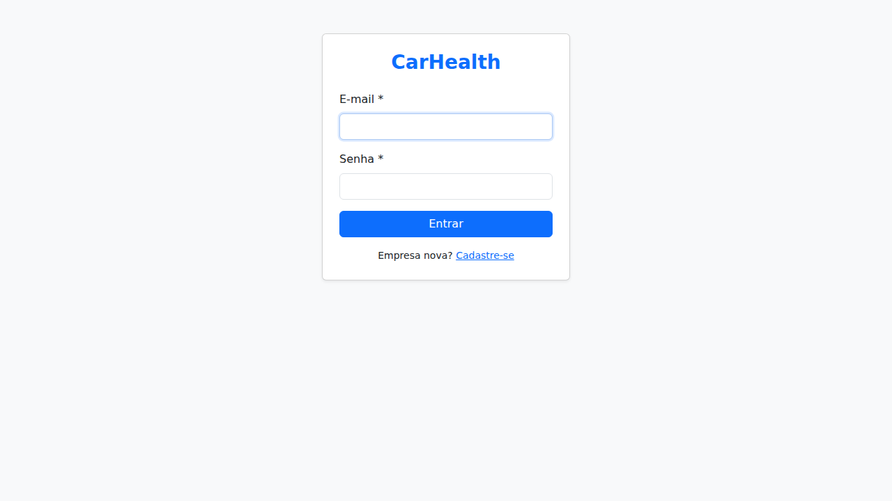
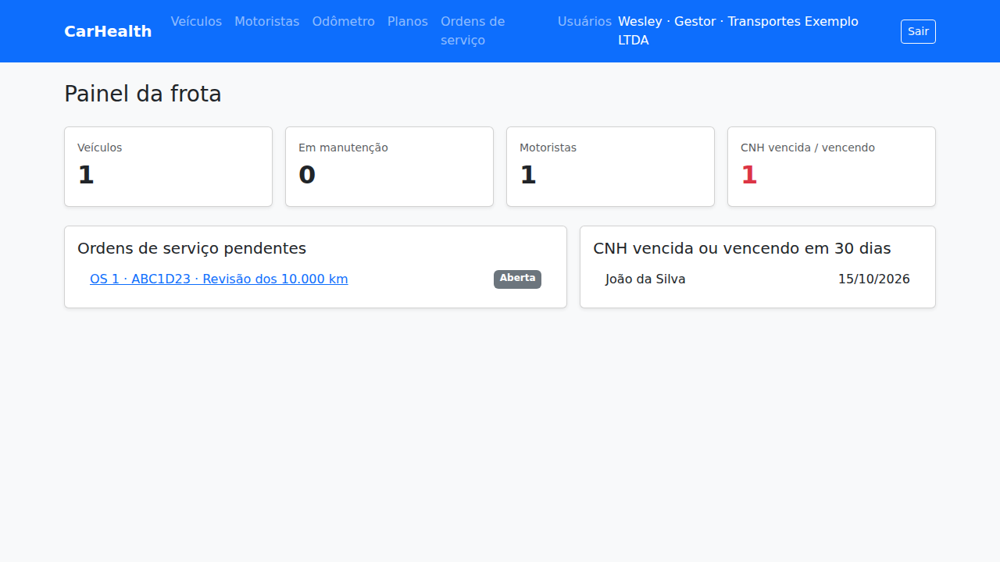

# CarHealth

Sistema web de gestão de manutenção de frotas — **Python + Django 5.2 + PostgreSQL 16**.

| Login | Painel |
|---|---|
|  |  |

## O que já está pronto (Sprint 03)

- **Autenticação**: cadastro da empresa + primeiro usuário (Gestor), login por e-mail/senha, logout, senha com hash, perfis **Gestor** e **Operador**.
- **CRUD completo** (listar, buscar, criar, editar, excluir) de: Veículos, Motoristas, Leituras de odômetro, Planos de manutenção, Ordens de serviço e Usuários (só Gestor).
- **Painel** com totais, OS pendentes e CNHs vencidas/vencendo.
- Cada empresa só enxerga os próprios dados.
- Banco idêntico ao modelo lógico (mesmos nomes de tabelas/colunas) + regras CHECK.
- 19 testes automatizados.
- Texto do **Capítulo 4 (4.3 a 4.7)** do Dossiê: [`docs/capitulo4_banco_de_dados.md`](docs/capitulo4_banco_de_dados.md) e SQL físico: [`docs/modelo_fisico.sql`](docs/modelo_fisico.sql).

## Como rodar no seu computador — passo a passo

### 1. Instale (uma vez só)

- **Python 3.11+** → <https://www.python.org/downloads/> (no Windows, marque *"Add Python to PATH"*).
- **PostgreSQL 16** → <https://www.postgresql.org/download/> (anote a senha do usuário `postgres` que o instalador pedir). O instalador já traz o **pgAdmin**.
- **Git** e **VS Code**.

### 2. Crie o banco de dados

Abra o **pgAdmin** → clique com o botão direito em *Servers > PostgreSQL 16 > Databases* → **Query Tool** e execute:

```sql
CREATE USER carhealth WITH PASSWORD 'carhealth' CREATEDB;
CREATE DATABASE carhealth OWNER carhealth;
```

(ou, pelo terminal: `psql -U postgres` e cole os mesmos comandos). O `CREATEDB` é necessário para rodar os testes.

> **Não** rode o `CREATE TABLE` manualmente: o Django cria as tabelas no passo 5.

### 3. Baixe o projeto e crie o ambiente virtual

No terminal (VS Code: menu *Terminal > New Terminal*):

```bash
git clone https://github.com/Wpabloz/CarHealth.git
cd CarHealth
git checkout claude/django-postgresql-schema-7s9hq1   # até o merge na main

python -m venv .venv
# Windows (PowerShell):
.venv\Scripts\Activate.ps1
# Linux / Mac:
source .venv/bin/activate

pip install -r requirements.txt
```

### 4. Configure o `.env`

Copie o arquivo de exemplo:

```bash
# Windows:  copy .env.example .env
# Linux/Mac: cp .env.example .env
```

Abra o `.env` e ajuste `DB_PASSWORD` (e os demais, se usou outros nomes no passo 2). Esse arquivo **não** vai para o GitHub.

### 5. Crie as tabelas e rode

```bash
python manage.py migrate      # cria as tabelas no PostgreSQL
python manage.py runserver    # sobe o sistema
```

Acesse <http://127.0.0.1:8000> → clique em **Cadastre-se** → informe um CNPJ válido (ex.: `11.222.333/0001-81`) e seus dados. Você entra como **Gestor**.

Para confirmar no pgAdmin: *Databases > carhealth > Schemas > public > Tables*.

### 6. Rodar os testes

```bash
python manage.py test
```

## Estrutura do projeto (onde fica cada coisa)

```
CarHealth/
├── carhealth/          # configuração do projeto
│   ├── settings.py     #   banco (lê o .env), login, sessão, idioma
│   └── urls.py         #   rotas principais
├── contas/             # AUTENTICAÇÃO + tabelas empresa e admin
│   ├── models.py       #   Empresa, Admin (usuário de login)
│   ├── validators.py   #   validação de CPF, CNPJ e placa
│   ├── forms.py        #   login, cadastro da empresa, novo usuário
│   ├── views.py        #   telas de login/cadastro/usuários
│   └── urls.py         #   /contas/login, /contas/cadastro, /contas/usuarios
├── frota/              # CRUDs do domínio
│   ├── models.py       #   Motorista, Veiculo, PlanoManutencao, LeituraOdometro, OrdemServico
│   ├── forms.py        #   formulários + regras de negócio
│   ├── views.py        #   classes-base Lista/Novo/Editar/Excluir + uma seção por entidade
│   ├── urls.py         #   /veiculos, /motoristas, /leituras, /planos, /ordens
│   └── migrations/     #   DDL gerado pelo Django (versionado)
├── templates/          # HTML (Bootstrap 5)
├── static/             # Bootstrap local (funciona sem internet)
└── docs/               # Capítulo 4, SQL físico e prints das telas
```

### Como adicionar um novo CRUD (ex.: Oficina)

1. `frota/models.py` → crie a classe com `db_table = "oficina"`.
2. `python manage.py makemigrations` e `python manage.py migrate`.
3. `frota/forms.py` → crie `OficinaForm(EmpresaForm)`.
4. `frota/views.py` → copie o bloco de "Planos de manutenção" e troque os nomes.
5. `frota/urls.py` → adicione uma linha `*crud("oficinas", "oficina", ...)`.
6. `templates/base.html` → adicione o link no menu.

## Rotas

| URL | Tela |
|---|---|
| `/contas/login/` | Login |
| `/contas/cadastro/` | Cadastro de empresa + gestor |
| `/contas/usuarios/` | Usuários (somente Gestor) |
| `/` | Painel |
| `/veiculos/`, `/motoristas/`, `/leituras/`, `/planos/`, `/ordens/` | CRUDs (`novo/`, `<id>/editar/`, `<id>/excluir/`) |
