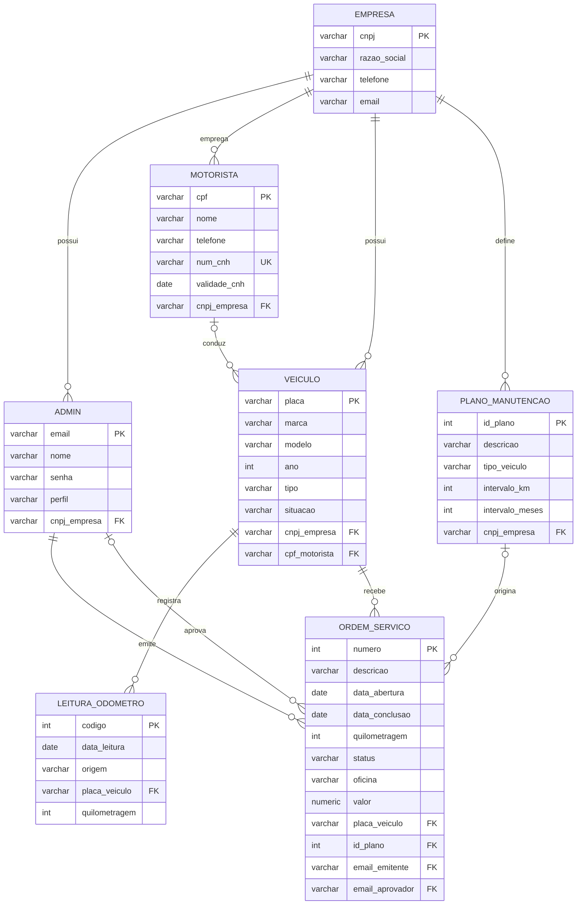

# Capítulo 4 – Banco de Dados (seções 4.3 a 4.7)

> Texto base para o Dossiê do Projeto CarHealth. Revise nomes, datas e ajuste ao padrão do documento antes de gerar o PDF.

---

## 4.3 Modelo lógico

O CarHealth gerencia a frota de veículos de empresas clientes. Cada **empresa** é um *tenant* (inquilino) independente: todos os demais dados pertencem, direta ou indiretamente, a uma empresa. O modelo lógico é composto por sete entidades.

### Entidades, chaves e atributos

Convenção: **PK** = chave primária, **FK** = chave estrangeira, **UK** = chave única (candidata), `?` = atributo opcional.

| Entidade | Chave primária | Chaves estrangeiras | Demais atributos |
|---|---|---|---|
| EMPRESA | cnpj | — | razao_social, telefone, email |
| ADMIN (usuário) | email | cnpj_empresa → EMPRESA | nome, senha, perfil |
| MOTORISTA | cpf | cnpj_empresa → EMPRESA | nome, telefone, num_cnh (UK), validade_cnh |
| VEICULO | placa | cnpj_empresa → EMPRESA; cpf_motorista? → MOTORISTA | marca, modelo, ano, tipo, situacao |
| PLANO_MANUTENCAO | id_plano (gerado) | cnpj_empresa → EMPRESA | descricao, tipo_veiculo, intervalo_km?, intervalo_meses? |
| LEITURA_ODOMETRO | codigo (gerado) | placa_veiculo → VEICULO | data_leitura, quilometragem, origem |
| ORDEM_SERVICO | numero (gerado) | placa_veiculo → VEICULO; id_plano? → PLANO_MANUTENCAO; email_emitente → ADMIN; email_aprovador? → ADMIN | descricao, data_abertura, data_conclusao?, quilometragem?, status, oficina?, valor? |

As chaves primárias de EMPRESA, MOTORISTA, VEICULO e ADMIN são **chaves naturais** (CNPJ, CPF, placa e e-mail), pois são únicas por definição e já identificam o registro no mundo real. Para PLANO_MANUTENCAO, LEITURA_ODOMETRO e ORDEM_SERVICO foram usadas **chaves substitutas** (números sequenciais), pois esses registros não possuem identificador natural.

### Relacionamentos e cardinalidades

| Relacionamento | Cardinalidade | Participação | Regra de negócio |
|---|---|---|---|
| EMPRESA **possui** ADMIN | 1 : N | Admin obrigatória | Todo usuário pertence a uma única empresa. |
| EMPRESA **emprega** MOTORISTA | 1 : N | Motorista obrigatória | Um motorista é cadastrado por uma empresa. |
| EMPRESA **possui** VEICULO | 1 : N | Veículo obrigatória | Cada veículo pertence a uma empresa. |
| EMPRESA **define** PLANO_MANUTENCAO | 1 : N | Plano obrigatória | Cada empresa define seus próprios planos. |
| MOTORISTA **conduz** VEICULO | 0..1 : N | Opcional nos dois lados | Um veículo tem no máximo um motorista responsável; um motorista pode ser responsável por vários veículos ou por nenhum. |
| VEICULO **registra** LEITURA_ODOMETRO | 1 : N | Leitura obrigatória | Cada leitura refere-se a um único veículo. |
| VEICULO **recebe** ORDEM_SERVICO | 1 : N | OS obrigatória | Cada OS é de um único veículo. |
| PLANO_MANUTENCAO **origina** ORDEM_SERVICO | 0..1 : N | Opcional para a OS | Uma OS preventiva aponta para o plano que a originou; uma OS corretiva não tem plano. |
| ADMIN **emite** ORDEM_SERVICO | 1 : N | Obrigatória para a OS | Toda OS registra quem a abriu. |
| ADMIN **aprova** ORDEM_SERVICO | 0..1 : N | Opcional para a OS | Preenchido quando um Gestor aprova a OS. |

### Diagrama lógico (notação pé-de-galinha)

> Dica: o diagrama acima é renderizado automaticamente no GitHub. Para o PDF, gere a imagem em <https://mermaid.live> (cole o bloco e exporte PNG) ou desenhe no brModelo/dbdiagram.io.

### Normalização

O modelo está na **3ª Forma Normal**: todos os atributos são atômicos (1FN); as tabelas com chave simples não possuem dependências parciais (2FN); e nenhum atributo não-chave depende de outro atributo não-chave (3FN) – por exemplo, os dados da empresa não são repetidos em VEICULO, apenas referenciados por `cnpj_empresa`. A quilometragem atual do veículo **não é armazenada** em VEICULO; ela é derivada da maior leitura em LEITURA_ODOMETRO, evitando redundância.

---

## 4.4 Modelo físico

### SGBD e ferramentas

| Item | Escolha |
|---|---|
| SGBD | **PostgreSQL 16** |
| Linguagem / framework | Python 3.11+ com **Django 5.2** |
| Driver | psycopg 3 |
| Criação do esquema | **Migrações do Django** (`python manage.py makemigrations` / `migrate`) |
| Script SQL equivalente | `docs/modelo_fisico.sql` no repositório |

### Como o modelo foi implementado

Cada entidade é uma classe `Model` do Django (arquivos `contas/models.py` e `frota/models.py`). Para que o banco fique idêntico ao modelo lógico, cada model usa `db_table` com o nome da tabela e `db_column` com o nome exato da coluna das chaves estrangeiras. As migrações (arquivos em `*/migrations/`) geram e versionam o DDL; assim qualquer integrante cria o banco com um único comando e as alterações futuras ficam registradas no Git.

| Tabela | Model Django | App |
|---|---|---|
| empresa | `Empresa` | contas |
| admin | `Admin` (é o usuário de login do sistema) | contas |
| motorista | `Motorista` | frota |
| veiculo | `Veiculo` | frota |
| plano_manutencao | `PlanoManutencao` | frota |
| leitura_odometro | `LeituraOdometro` | frota |
| ordem_servico | `OrdemServico` | frota |

### Mapeamento de tipos

| Tipo lógico | Tipo PostgreSQL | Campo Django |
|---|---|---|
| Texto curto | `varchar(n)` | `CharField(max_length=n)` / `EmailField` |
| Data | `date` | `DateField` |
| Inteiro | `integer` | `IntegerField` |
| Monetário | `numeric(10,2)` (precisão exata, sem erro de arredondamento) | `DecimalField(max_digits=10, decimal_places=2)` |
| Identificador gerado | `integer GENERATED BY DEFAULT AS IDENTITY` | `AutoField(primary_key=True)` |

### Decisões físicas

- **Identity columns**: `id_plano`, `codigo` e `numero` usam `GENERATED BY DEFAULT AS IDENTITY` (padrão SQL, substitui o antigo `serial`).
- **Índices**: o PostgreSQL cria índice automaticamente para cada PK e UNIQUE. Foram criados também índices em **todas as chaves estrangeiras**, pois as consultas do sistema sempre filtram por empresa e por veículo.
- **Chaves estrangeiras** são criadas como `DEFERRABLE INITIALLY DEFERRED` pelo Django: a verificação acontece no final da transação, o que permite inserir registros relacionados em uma mesma transação em qualquer ordem.
- **Tabelas de apoio do framework**: além das 7 tabelas do domínio, o Django cria `django_session` (sessões de login), `django_migrations` (histórico das migrações), `django_content_type`, `auth_permission` e `auth_group`.
- **Configuração de conexão**: dados de acesso (nome do banco, usuário, senha, host) ficam no arquivo `.env`, fora do código-fonte e fora do Git.

---

## 4.5 Dicionário de dados

Legenda: **PK** chave primária · **FK** chave estrangeira · **UK** valor único · **NN** obrigatório (NOT NULL) · **CK** regra CHECK.

### EMPRESA – empresas clientes (tenants)

| Campo | Tipo | Restrições | Descrição |
|---|---|---|---|
| cnpj | varchar(14) | PK, NN | CNPJ somente com dígitos; dígitos verificadores validados pela aplicação. |
| razao_social | varchar(120) | NN | Razão social da empresa. |
| telefone | varchar(15) | NN | Telefone de contato. |
| email | varchar(120) | NN | E-mail de contato da empresa (formato validado). |

### ADMIN – usuários do sistema

| Campo | Tipo | Restrições | Descrição |
|---|---|---|---|
| email | varchar(120) | PK, NN | E-mail usado como login; gravado em minúsculas. |
| nome | varchar(120) | NN | Nome do usuário. |
| senha | varchar(255) | NN | **Hash** da senha (PBKDF2-SHA256 com salt). Nunca é armazenada em texto puro. |
| perfil | varchar(20) | NN, CK (`GESTOR`, `OPERADOR`) | Nível de acesso. Gestor gerencia usuários e aprova ordens de serviço. |
| cnpj_empresa | varchar(14) | FK → empresa, NN | Empresa à qual o usuário pertence. |

### MOTORISTA

| Campo | Tipo | Restrições | Descrição |
|---|---|---|---|
| cpf | varchar(11) | PK, NN | CPF somente com dígitos; dígitos verificadores validados. |
| nome | varchar(120) | NN | Nome completo. |
| telefone | varchar(15) | NN | Telefone de contato. |
| num_cnh | varchar(11) | UK, NN | Número de registro da CNH (não pode se repetir). |
| validade_cnh | date | NN | Data de validade da CNH; o painel alerta CNHs vencidas ou que vencem em até 30 dias. |
| cnpj_empresa | varchar(14) | FK → empresa, NN | Empresa empregadora. |

### VEICULO

| Campo | Tipo | Restrições | Descrição |
|---|---|---|---|
| placa | varchar(8) | PK, NN | Placa sem hífen, maiúscula. Aceita padrão antigo (ABC1234) e Mercosul (ABC1D23). |
| marca | varchar(50) | NN | Fabricante. |
| modelo | varchar(60) | NN | Modelo. |
| ano | integer | NN, CK (1950 a 2100) | Ano de fabricação. |
| tipo | varchar(30) | NN | `CARRO`, `MOTO`, `UTILITARIO`, `VAN`, `CAMINHAO`, `ONIBUS`. |
| situacao | varchar(20) | NN, CK (`ATIVO`, `MANUTENCAO`, `INATIVO`) | Situação operacional. |
| cnpj_empresa | varchar(14) | FK → empresa, NN | Empresa proprietária. |
| cpf_motorista | varchar(11) | FK → motorista, opcional | Motorista responsável. Se o motorista for excluído, o campo volta a ficar vazio. |

### PLANO_MANUTENCAO – manutenção preventiva

| Campo | Tipo | Restrições | Descrição |
|---|---|---|---|
| id_plano | integer identity | PK, NN | Identificador gerado automaticamente. |
| descricao | varchar(120) | NN | Ex.: "Troca de óleo e filtro". |
| tipo_veiculo | varchar(30) | NN | Tipo de veículo ao qual o plano se aplica. |
| intervalo_km | integer | CK (> 0), opcional | Periodicidade em quilômetros. |
| intervalo_meses | integer | CK (> 0), opcional | Periodicidade em meses. |
| cnpj_empresa | varchar(14) | FK → empresa, NN | Empresa dona do plano. |
| *(regra da tabela)* | — | CK | Pelo menos um dos intervalos (km ou meses) deve ser informado. |

### LEITURA_ODOMETRO

| Campo | Tipo | Restrições | Descrição |
|---|---|---|---|
| codigo | integer identity | PK, NN | Identificador gerado. |
| data_leitura | date | NN | Data em que a quilometragem foi lida. |
| origem | varchar(20) | NN | `MANUAL` (usuário), `MOTORISTA` ou `ORDEM_SERVICO` (gerada ao concluir uma OS). |
| placa_veiculo | varchar(8) | FK → veiculo, NN | Veículo lido. |
| quilometragem | integer | NN, CK (≥ 0) | Valor do odômetro; não pode ser menor que a leitura anterior do mesmo veículo. |

### ORDEM_SERVICO

| Campo | Tipo | Restrições | Descrição |
|---|---|---|---|
| numero | integer identity | PK, NN | Número da OS. |
| descricao | varchar(255) | NN | Serviço a executar. |
| data_abertura | date | NN | Data de abertura. |
| data_conclusao | date | opcional, CK (≥ data_abertura) | Obrigatória quando o status é `CONCLUIDA`. |
| quilometragem | integer | opcional, CK (≥ 0) | Km do veículo no serviço. |
| status | varchar(20) | NN, CK | `ABERTA` → `APROVADA` → `EM_EXECUCAO` → `CONCLUIDA`, ou `CANCELADA`. |
| oficina | varchar(120) | opcional | Oficina responsável. |
| valor | numeric(10,2) | opcional, CK (≥ 0) | Custo do serviço em R$. |
| placa_veiculo | varchar(8) | FK → veiculo, NN | Veículo atendido. |
| id_plano | integer | FK → plano_manutencao, opcional | Plano que originou a OS (preventiva). |
| email_emitente | varchar(120) | FK → admin, NN | Usuário que abriu a OS (preenchido automaticamente). |
| email_aprovador | varchar(120) | FK → admin, opcional | Gestor que aprovou (preenchido automaticamente). |

---

## 4.6 Integridade e consistência

A integridade é garantida em **duas camadas**: no próprio banco (vale para qualquer programa que acesse os dados) e na aplicação (regras de negócio e mensagens amigáveis ao usuário).

### No banco de dados (PostgreSQL)

| Mecanismo | Onde é aplicado | O que previne |
|---|---|---|
| **PRIMARY KEY** | Todas as tabelas | Registros duplicados (mesmo CNPJ, CPF, placa ou e-mail). |
| **UNIQUE** | `motorista.num_cnh` | Mesma CNH cadastrada para dois motoristas. |
| **FOREIGN KEY** | 10 relacionamentos | Registros "órfãos" (ex.: OS de veículo inexistente). Exclusões de registros referenciados são bloqueadas. |
| **NOT NULL** | Campos obrigatórios | Cadastros incompletos. |
| **CHECK** `ck_veiculo_ano`, `ck_leitura_km`, `ck_os_valor`, `ck_os_quilometragem`, `ck_plano_intervalo_*` | veiculo, leitura, OS, plano | Valores fora da faixa (ano 1800, km ou valor negativo, intervalo zero). |
| **CHECK** de domínio `ck_veiculo_situacao`, `ck_os_status`, `ck_admin_perfil` | veiculo, OS, admin | Valores fora da lista permitida. |
| **CHECK** `ck_plano_algum_intervalo` | plano_manutencao | Plano sem nenhuma periodicidade. |
| **CHECK** `ck_os_datas` | ordem_servico | Conclusão anterior à abertura. |
| **Identity** | id_plano, codigo, numero | Números repetidos ou gerados manualmente. |
| **Transações** | Cadastro de empresa + gestor; conclusão de OS + leitura de odômetro | Gravação parcial: ou tudo é salvo, ou nada. |

### Na aplicação (Django)

- **Validação de documentos**: dígitos verificadores de CPF e CNPJ e formato de placa (antiga/Mercosul) – `contas/validators.py`.
- **Padronização antes de gravar**: CPF/CNPJ só com dígitos, placa em maiúsculas sem hífen, e-mail em minúsculas. Isso evita duplicidades "disfarçadas" (ex.: `abc-1234` e `ABC1234`).
- **Odômetro sempre crescente**: uma nova leitura não pode ser menor que a última leitura anterior do mesmo veículo.
- **Coerência entre entidades**: o plano de uma OS precisa ser do mesmo tipo do veículo; uma OS concluída exige data de conclusão.
- **Fluxo de aprovação**: apenas usuário com perfil Gestor pode mover uma OS para Aprovada/Em execução/Concluída; o aprovador e o emitente são preenchidos pelo sistema, não pelo usuário.
- **Isolamento entre empresas**: todas as consultas são filtradas pela empresa do usuário logado e as listas de seleção (veículo, motorista, plano) só mostram itens da própria empresa, impedindo relacionamentos cruzados entre empresas.
- **Chaves imutáveis**: CPF e placa ficam bloqueados na tela de edição, evitando alteração de chave primária.
- **Exclusão protegida**: ao tentar excluir um veículo com leituras/OS, ou um usuário que emitiu OS, o sistema mostra aviso e mantém o histórico.
- **Testes automatizados** (`python manage.py test`) verificam estas regras a cada alteração do código.

---

## 4.7 Segurança e privacidade

### Dados pessoais tratados (LGPD – Lei 13.709/2018)

| Titular | Dados pessoais | Finalidade |
|---|---|---|
| Motorista | nome, CPF, telefone, nº e validade da CNH | Identificar o condutor responsável pelo veículo e verificar se está habilitado. |
| Usuário (admin) | nome, e-mail, senha (hash) | Autenticação e registro de quem abriu/aprovou ordens de serviço. |

Não são coletados dados pessoais sensíveis (art. 5º, II – saúde, biometria, origem racial etc.). Dados de empresa (CNPJ, razão social) não são dados pessoais.

**Papéis:** a empresa cliente é a **controladora** dos dados de seus motoristas e usuários; o CarHealth atua como **operador**, tratando os dados conforme as instruções do cliente.

**Bases legais** (art. 7º): execução de contrato e procedimentos preliminares (inciso V) para os usuários do sistema; cumprimento de obrigação legal/regulatória (inciso II) e legítimo interesse do empregador na gestão da frota (inciso IX) para os dados dos motoristas, incluindo a verificação da validade da CNH exigida pelo Código de Trânsito Brasileiro.

### Medidas implementadas

| Medida | Como foi feito |
|---|---|
| **Senhas protegidas** | Armazenadas com hash **PBKDF2-SHA256 + salt** (padrão do Django 5.2, com 1.000.000 de iterações). Nem os desenvolvedores conseguem ver a senha original. |
| **Política de senha** | Validadores exigem tamanho mínimo, rejeitam senhas comuns, apenas numéricas ou parecidas com o nome/e-mail. |
| **Autenticação e sessão** | Todas as páginas exigem login. Sessão expira em 8 horas ou ao fechar o navegador; cookie `HttpOnly` (e `Secure` em produção). Logout somente por POST. |
| **Controle de acesso por perfil** | Gestor: gerencia usuários e aprova OS. Operador: operações do dia a dia. |
| **Isolamento entre clientes (multi-tenant)** | Cada usuário só acessa dados da própria empresa; acessar o endereço de um registro de outra empresa retorna "não encontrado" (404). |
| **Proteção contra ataques web** | Token **CSRF** em todos os formulários; ORM do Django com consultas parametrizadas (previne **SQL Injection**); escape automático nos templates (previne **XSS**); proteção contra *clickjacking*. |
| **Segredos fora do código** | Senha do banco e `SECRET_KEY` ficam no arquivo `.env`, que está no `.gitignore` e não vai para o GitHub. |
| **Minimização** | Somente os dados necessários à finalidade são coletados (ex.: não se armazena endereço nem foto do motorista). |
| **Rastreabilidade** | Cada OS registra quem a emitiu e quem a aprovou. |

### Medidas planejadas para produção

- Acesso exclusivamente via **HTTPS** e `DEBUG=False`.
- Usuário do PostgreSQL com **privilégio mínimo** (apenas SELECT/INSERT/UPDATE/DELETE nas tabelas da aplicação; sem superusuário) e banco não exposto à internet.
- **Backup** diário automatizado (`pg_dump`) com cópia criptografada fora do servidor e teste periódico de restauração.
- **Direitos do titular** (art. 18): tela para o Gestor exportar e corrigir os dados de um motorista; quando houver histórico de OS vinculado, a exclusão será feita por **anonimização** (substituir nome/CPF/telefone) para preservar o histórico da frota.
- **Retenção**: dados de motoristas desligados anonimizados após o término do contrato com o cliente, salvo obrigação legal de guarda.
- **Registro de incidentes**: procedimento para comunicar a ANPD e os titulares em caso de incidente de segurança (art. 48).
- Termo de uso e **política de privacidade** apresentados no cadastro da empresa.
